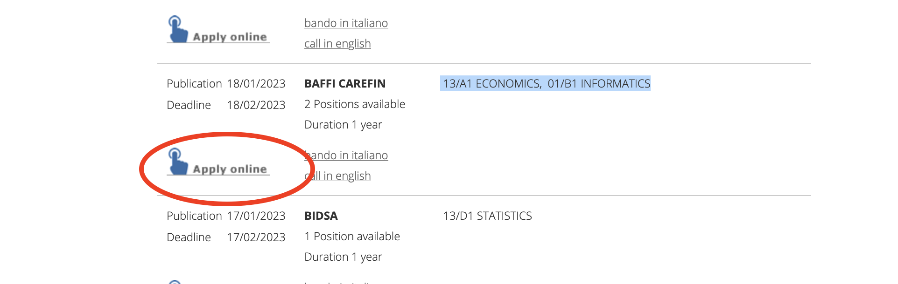

PI: [Carlo Schwarz](https://carloschwarz.eu)
co-PI [Dirk Hovy](https://milanlproc.github.io/authors/1_dirk_hovy/)

---
Over the last decade, discontent in democracy, mistrust in institutions, and the rise of populist parties have strained European societies. Underlying these tensions are often increasing inequalities in Western countries, which fuel the discontent of individuals. The Covid pandemic further exacerbated these problems, as anti-Covid measures taken by governments differently impacted societal groups. The MENTALISM project combines modern social media analysis with traditional survey data to track inequality across Italy through the lens of the pandemic.
Our ground-breaking mixed-methods approach uses machine learning and text analysis to trace online grievances in a vast corpus of social media data. We combine these methods with survey protocols and econometric analysis to validate the findings and provide actionable policy advice. MENTALISM combines the advantages of social media data (high-frequency, individual-level information) with the strength of socio-economic surveys (representativeness). Our novel interdisciplinary approach will critically evaluate the value of social media monitoring for policy feedback. Moreover, it will establish protocols for policymakers to better respond to growing grievances brought on by inequality at various steps in the process.
Successful candidates will work closely with Profs. Carlo Schwarz (economics), Dirk Hovy (NLP), and the MilaNLP lab.
Your profile:

- a Ph.D. in Computer Science, Computational Linguistics/NLP, Machine Learning, Data Science, or related fields.
- Excellent programming skills in Python. Additional languages (C++, R, etc) a plus.
- Fluency in spoken and written English. Knowledge of Italian is NOT a requirement.
- Knowledge of current neural network models and implementation tools for neural networks (e.g. PyTorch, Tensorflow, Keras, etc.).
- Experience with publications in top-tier venues in the field of NLP/Computational Linguistics.

Position Details:

- Starting date: March 1 2023, or any time thereafter
- Duration: 1 year
- Deadline: 18th February 2023
- Salary: 42k EUR p.a. (median salary Milan: 37k EUR). Applicants from outside Italy may qualify for a researcher taxation scheme
- Date posted: 18th January 2023

How to apply:

Go to the [Bocconi postdoc job market page](https://jobmarket.unibocconi.eu/?type=a&urlBack=/wps/wcm/connect/bocconi/sitopubblico_it/albero+di+navigazione/home/docenti+e+ricerca/docenti/reclutamento+docenti/concorsi/assegni+di+ricerca/) and search for "*BAFFI CAREFIN*". There are two positions, in13/A1 ECONOMICS and 01/B1 INFORMATICS.
You will then have to click on "Apply online" for proceeding with the application. See below the screenshot of the application platform.
Official job description at this [link](https://jobmarket.unibocconi.eu/include/dwload.php?a=MzQxXjE1YzQzZDE3NTVmOTdjZTc2ZmUzZDRhYzJiYTMzOWFmXi9kMC9hcGFjaGUvam9ibWFya2V0LnVuaWJvY2NvbmkuZXUvZGF0YS91cGxvYWQvQkFGL3Nlc3Npb25fMjkyLTIwMjMwMTE4Xmpta19zZXNfZmlsZV5qbWZfXmptZl9maWxlXjExMTI=). 
Candidates should attach publications and a cover letter to their application. 
Online interviews will presumably take place during March 2023. 
Please contact <dirk.hovy@unibocconi.it> if you have any questions.

